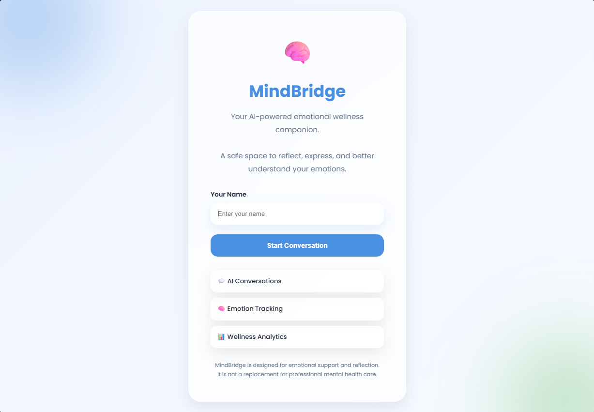
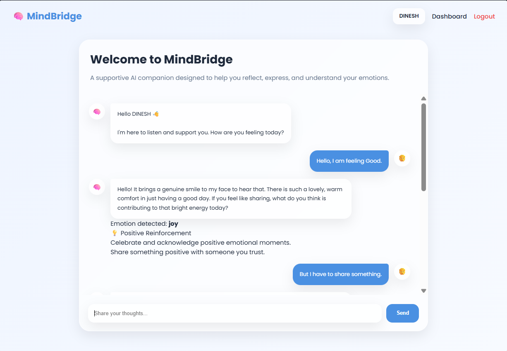
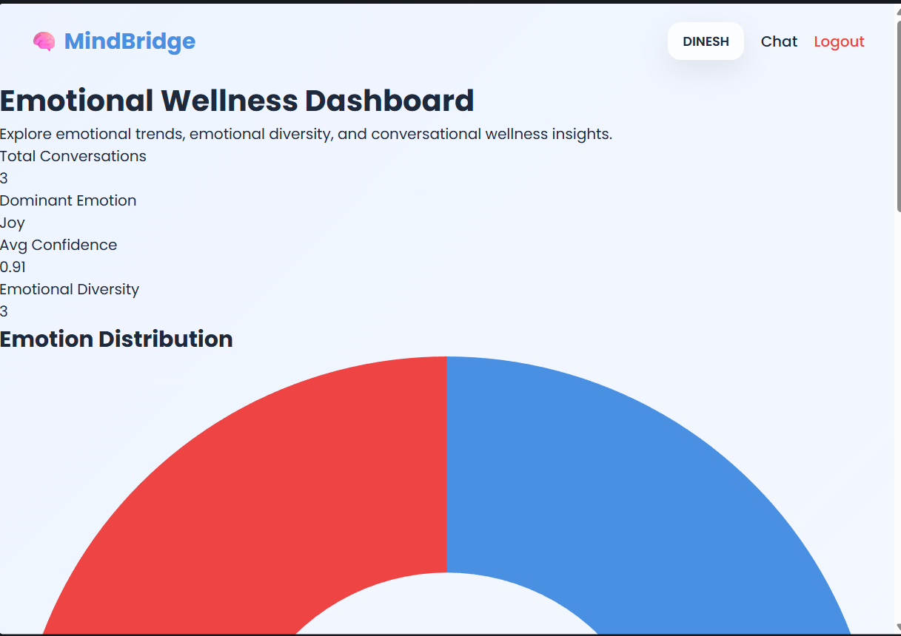

# 🧠 MindBridge

An AI-powered emotional wellness platform built using Flask, Google Gemini, emotional intelligence models, and behavioral analytics.

MindBridge combines conversational AI, emotion detection, CBT-inspired support systems, and wellness analytics into a modern full-stack AI application.

---

# ✨ Features

## 🤖 AI Emotional Companion

- Google Gemini powered conversations
- Emotion-aware responses
- Contextual memory
- Human-like empathetic interactions

---

## 🧠 Emotion Detection

- Transformer-based emotion classifier
- Confidence scoring
- Emotional trend tracking
- Emotion-aware conversation pipeline

Supported emotions:

- Joy
- Sadness
- Anger
- Fear
- Surprise
- Disgust
- Neutral

---

## 🚨 Crisis Detection System

MindBridge includes a dedicated AI safety layer:

- Crisis keyword detection
- Risk classification
- Emergency support resources
- Safety-first response system

---

## 💡 CBT Support Layer

Built-in emotional support interventions:

- Grounding techniques
- Breathing exercises
- Reflection prompts
- Mindfulness guidance

---

## 📊 Emotional Analytics Dashboard

Interactive wellness analytics including:

- Emotion distribution
- Confidence trends
- Emotional diversity
- Recent emotional activity
- Behavioral insights

---
# 📸 Screenshots

## Login Interface



## AI Chat Interface



## Emotional Analytics Dashboard



---
# 🏗️ Architecture

MindBridge uses a modular AI system architecture.

```plaintext
Frontend Layer
    ↓

Flask Application Layer
    ↓

Route Orchestration Layer
    ↓

AI Services Layer
    ↓

LLM Intelligence Layer
    ↓

Database Memory Layer